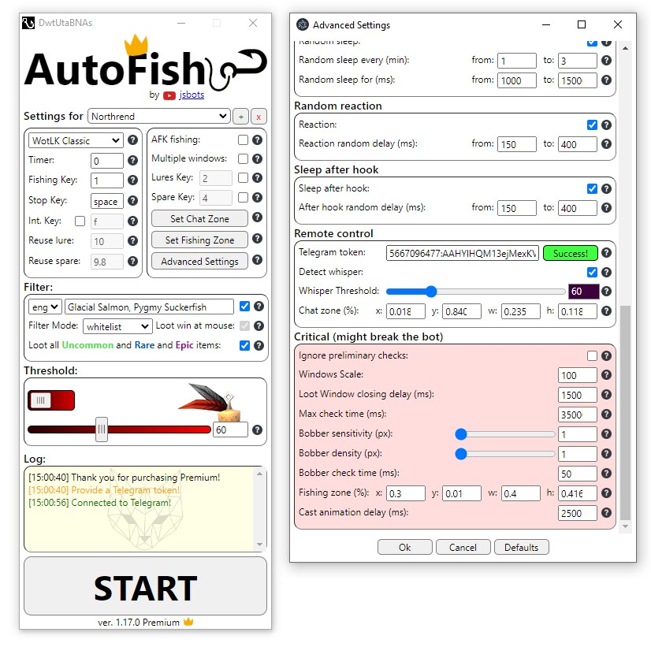
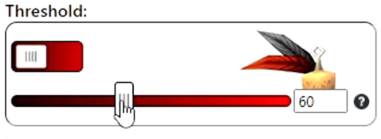
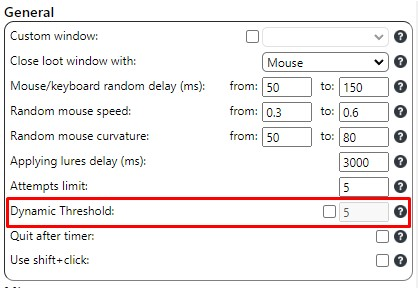

<p align="center">  </p>
<div align="center">

  [](https://github.com/olesgeras/AutoFish/blob/4c5f0fdb5af0f1378f3318d563c5738fa7580e2f/LICENSE)
<a href="https://youtu.be/A3W8UuVIZTo"></a>

</div>

## Table of Contents :page_with_curl:

- [Fishing bot](#fishing-bot-fish)
- [Servers tests](#servers-tests-video_game)
- [Disclaimer](#disclaimer-warning)
- [Guide](#guide-blue_book)
- [Threshold](#threshold-red_circle)
- [Fishing zone](#fishing-zone-dart)
- [Applying Lures](#applying-lures-pushpin)
- [Interactive key](#interactive-key)
- [Soulbound items](#soulbound-items-auto-confirmation-large_blue_diamond)
- [Remote control](#telegram-remote-control-iphone)
- [Mammoth Selling](#mammoth-selling-elephant)
- [AFK Fishing](#afk-fishing-sleeping)
- [Multiple Windows](#multiple-windows-rocket)
- [Sound Detection](#sound-detection-loud_sound)
- [Download](#download-open_file_folder)

## Fishing bot :fish:

A fishing bot for World of Warcraft, wrapped in [Electron](https://github.com/electron/electron) it uses [keysender](https://github.com/Krombik/keysender) and [nut.js](https://github.com/nut-tree/nut.js) libraries to analyze the screen and automate a fishing process in a human-like manner. The bot can work with one or multiple windows of the game at the same time. The bot also uses [tesseract.js](https://github.com/naptha/tesseract.js) for analyzing loot.

<p align="center">

</p>

**Features:**
- Optional loot support.
- Fishing lures support.
- Custom window support.
- Auto confirmation for soulbound items.
- Missing on purpose feature.
- Logging out/in feature.
- Switching between red/blue feathers feature.
- Convoluted automation (random sleep, random reaction, random sleep after catching, random mouse speed/curvature, random click on the bobber, random bobber highlighting)

**Premium Features:**
- Remote control via Telegram.
- Multiple game windows support (up to 4).
- Sound Detection.
- Mammoth Selling.
- AFK Fishing Mode (auto-focusing the window only when catching/casting).
- 4K resolution support.
- Profiles support.

<p align="center">

</p>

For more detailed review you can watch  [AutoFish 1.12](https://youtu.be/A3W8UuVIZTo)

This is so called "pixel bot", it doesn't change anything in the processes memory nor use any vision libraries like OpenCV, it uses a simpler solution: it analyzes the window of the game for condensed red colors and then sticks to them checking the area for changes. It moves with the bobber while the bobber slowly wobbles, but when the bobber is jerked, it clicks on it and catches the fish.

The bot doesn't work in the background and requires the window of the game to be opened all the time, to get around this you can use a **virtual machine** (like [VirtualBox](https://www.virtualbox.org/) or [VMware Player](https://www.vmware.com/products/workstation-player.html)) with installed World of Warcraft and launch AutoFish there.

## Servers tests :video_game:

The bot was tested on official servers:
-   **Dragonflight**
-   **Classic**
-   **WotLK Classic**

Also on unofficial servers:
-   **Legion**
-   **MoP**
-   **Cataclysm**
-   **WotLK**
  -    **Ascension** (use **custom window** option and choose *Ascension* window. Launch the bot as admin)
-   **TBC**
-   **Vanilla**
  -   **Turtle WoW** (because of uncomplete animtion of the jerking, use sound detection for better performance)


## Disclaimer :warning:

  Using bots in most of the games is prohibited, by doing so you should understand all the risks such an act entails: being banned, losing account, losing real money etc.

  Use this software at **your own risk**. No one will be responsible for any consequences except yourself. The software is in no way *"undetectable"* and I don't guarantee **anything** related to the bot and the software is provided *as is*.

  To minimize risks all the delay values were randomized: delays between clicks/pressing, sleep time (optional), reaction time (optional), after hook time (optional), the curvature and the speed of the mouse (optional), random click on the bobber, random highlighting of the bobber, the names of the folder where the bot is installed are generated per install, the names of the title of the bot window are generated per launch.

  Using common sense while using the bot will help to reduce risks of being banned:
  - **Don't leave the bot alone for a long time.**
  - **Don't fish in one place all the time.**
  - **Try to combine gameplay between fishing: run some dungeons, chat with somebody etc.**

  Anyone who can see you for more than 15m on one spot might suspect something and report you, or might not.  It all depends on many external factors: who, where and why.

  :bangbang:  Read [this](https://www.ownedcore.com/forums/wow-classic/wow-classic-guides/933772-what-you-need-know-if-you-want-use-fishing-bot.html#post4281886) and use **Miss on purpose** and **Log in/Log out** options as described in that guide.

## Guide :blue_book:

*The bot was tested only with default UI and with default UI scale, without any addons whatsoever. So turn off all the addons and set UI scale to default before using the bot. Especially this is related to all fishing addons like Fishing Buddy and others, if you use any of them, turn off all the UI features they have.*

*The bot uses *squirrel* type of installation and silently creates a shortcut on your desktop.*

1. Launch the game.
2. Are you using **Filter** feature?
   - Yes: Turn off **Auto Loot** in the game, set **UI scale** in the game to default, turn on **Open loot window at mouse** in the game.
   - No: Turn on **Auto Loot** in the game.
3. Assign your 'fishing' and 'lures' keys in the game and write them in the respective sections in the UI of the bot.
4. Find a place to fish and set your **Fishing Zone** by pressing "Set Fishing Zone" button (Carefully read [Fishing zone](#fishing-zone-dart) section). Avoid any red/blue colors in the Fishing zone except the red/blue feather of the bobber. Take into account mobs lurking below in the water, their red names might break the bot (you can turn off all the names in the game) (Carefully read [Threshold](#threshold-red_circle) section).
5. Press Start button and don't use your mouse and keyboard (use the bot on VM if you need it to work in the background).

*After you pressed Start a lot of things might happen instead of the bot working properly, so before telling me in discord how frustrated you are :upside_down_face:, read [Fishing zone](#fishing-zone-dart) and [Threshold](#threshold-red_circle) and also Hints and issues section to solve 99% of the possible issues.*

6. To stop the bot press your stop key (default: space).

### Hints and issues

- Initially the bot will make a preliminary check for red/blue colors before casting, if it finds any, it will stop working: change your **Fizhing Zone** or increase Threshold or change the place.
- If the bot clicks too early, first try from the 1st person view, if that didn't help, increase either **Bobber Sensitivity** (especially if it's Dragonflight) or **Bobber Density** (especially if it's not Dragonflight) values (You can find them in the **Advanced Settings**).
- The bot will make 5 attempts to cast and find the bobber (default: 5). If it fails, it will stop the application.
- If you use Filter feature in different from English languages for the first time, wait until the bot downloads the data for your language. Also read about [Soulbound items](#soulbound-items-auto-confirmation-large_blue_diamond).
- If the bot doesn't move/press/clicks your mouse, try to launch it as administrator. (especially if you use it on private servers)
- Filter works properly only with 16:9 resolutions right now: **1366x768** or **1920x1080** or **3840x2160**
- Don't fish near other players, the bot might confuse their bobber for yours.
- If **Lunkers** bother you in Dragonflight, you might need to turn off sleeping or decrease it to around 0.5 - 5 seconds.
- If you use many monitors the game should be on the primary one.
- Sound Detection feature might not work with some audio devices, in that case you need to switch to another device (e.g. you are using headphones and sound detection doesn't work, then plug in speakers and test again).
- The bot might not work properly if you have **latency issues**.
- You can turn off all the "sleeping" and random values to make the bot work **2-3 times** faster.
- If you want to use the bot with multiple windows don't forget to switch the game to **DirectX 11**.
- [Supported keys for the bot](https://github.com/Krombik/keysender#keyboardbutton) *(except num's and Fs)*

## Threshold :red_circle:

<p align="center">

</p>

Threshold value is an RGB value of a red or blue color, depends on what switch you use, that represent a color threshold below which the bot will ignore all the respected colors.

For example if I use red switch and my threshold is 60, the bot will ignore all the colors below this value, by doing so it will see only the reddest parts of the screen and that's what we need: a red feather on the bobber. **So the higher the threshold, the less red colors the bot will recognize and the other way around: the lower is the threshold the more red colors on the screen the bot will recognize.**

>Found red/blue colors before casting. Change your Fishing Zone or increase the Threshold value or change the fishing place.

With this error the bot will highlight the area where it ran into the same colors as your threshold value. Tweak the **Fishing Zone** or change your fishing place. If the error happens because of some reddish water, use the blue switch or increase **Threshold** value.  

> Have tried n attempts to find the bobber and failed: decrease the red color "threshold" value or change the fishing place.

If you see this error, it means you need to decrease threshold or change the direction/position of your fishing place to make the bobber brighter.

### Dynamic Threshold

<p align="center">

</p>

It's simple, the bot will decrease threshold by the provided value (default: 5) after n number of failed attempts to find the bobber (default: 5) and will try to make another n attempts to find the bobber decreasing it until it reaches *Threshold < 20*. This option is good to make the bot keep working even during the bad weather when the color/brightness of the bobber is drastically decreased.   

## Fishing Zone :dart:

<p align="center">

</p>

Fishing zone is a resizable and movable area in the water where your bobber might land. The bot looks for the bobber only in this area.

Fishing Zone is an **overlay** window on your screen, so the colors of your character and the colors of some text on your screen will be recognized by it too. And because there's surely a red/blue color of some armor on your character - you should avoid it in the Fishing Zone.

Fishing Zone has **"Check"** button to help you understand whether there's any red/blue colors of the provided threshold value in the Fishing Zone before casting a bobber. It fully depends on **Threshold** value, so again, if after pressing Check button the window changes to red color - close the window, slowly increase Threshold and test again. Repeat until the window changes to green.

The rule of thumb here is **the better you can see the red/blue feather the better the bot will see it too**:
- If you can, make your video settings as best as possible, except the weather effects...
- Turn off all the weather effects so that the bot won't confuse rain/fog for jerking of the bobber. But if the weather is *really* bad (like a blizzard), it might drastically reduce the efficiency of the bot. Solution: find another place, switch between blue/red feathers or wait for the better weather.
- Different direction might make the red feather of the bobber either brighter or darker, bigger or smaller, this all will impact the efficiency of the bot. In most cases the place doesn't matter **it's all about direction and position**.
- Camera position isn't so important, but sometimes, if the place is dark/snowy, closer view to the bobber might help. The best position is just a normal 3rd person view.
- Tweak gamma/brightness/contrast settings to make the bobber brighter and more colorful.
- For very dark zones you can try other bobbers that have distinct red/blue colors on them instead of the default one.

Watch  [AutoFish 1.12](https://youtu.be/A3W8UuVIZTo) for video explanation.

Here are quick self-explanatory **"good-bad"** screenshots of the bobber:
<p align="center">


</p>

## Applying Lures :pushpin:
For **Dragonflight** and **Classic/Vanilla** you need to use a macro that will apply the lures onto your fishpole and assign that macro to **Lures Key** option:

**Dragonflight**:

```
/use *lure_name*
/use *fishpole_name*
```

**Classic**:

```
/equip *fishpole_name*
/use *lure_name*
/use 16
```

**Vanilla**:

```
/script UseAction(*your lures key*);
/script PickupInventoryItem(16);
/script ReplaceEnchant();
```

## Interactive key

In **Dragonflight** You can use interactive key to catch your fish, if you want to use it with the bot, turn on Int. Key option and assign the same key you use for interactive key in the game.

<p align="center">

</p>

To make the interactive key work, you use this commands (write them in the chat and press enter, one by one):
```
/console SoftTargetInteractArc 2  - This will allow you to interact with the bobber no matter which way you are facing.
/console SoftTargetInteractRange 30  - This increases the interaction range to 30 yards. Adjust to your needs
```

## Soulbound items auto-confirmation :large_blue_diamond:

If you want the bot to confirm rare Soulbound items, turn on **Loot all Uncommon and Rare items** option. If the item requires confirmation on looting, the bot will confirm it automatically. **This won't work with AutoLoot turned on**, so if you need such items always use **whitelist**. **This feature also doesn't work with any other language except English**. As a solution (both if you need AutoLoot on and if your WoW isn't in English) use [AutoLooter](https://www.curseforge.com/wow/addons/autolooter) instead.

<p align="center">

</p>

## Telegram remote control :iphone:

*This feature is available only for [Premium version](https://www.buymeacoffee.com/jsbots/e/96734) of the app*

1. Get the token from [BotFather](https://t.me/BotFather) by using /newbot command and following the instruction. Imagine some long and random name for the bot so that someone won't accidentally join your bot and gain control over your fishing process.
2. Paste the token to **Telegram token** input field in **Remote Control** section in the **Advanced Settings** and press enter.

<p align="center">

</p>

3. Press **Connect** button and wait until the name of the button changes to either **done** or **error* (*might take awhile*).
4. Open the bot in your Telegram and either press /start or write /start command.
5. If evertyhing is OK, the bot will reply with:

<p align="center">

</p>

6. Now set your **Chat Zone** as on the screenshot below by pressing **Set Chat Zone** button on the main window of the AutoFish.

<p align="center">

</p>

7. If you want to make the bot notify you about any errors or whipser messeges, *you need to start it from Telegram* (*not by pressing Start on the bot's interface*). Whisper detection will work much better and reliable if you **turn off all the other chat messages**.

## Multiple Windows :rocket:

*This feature is available only for [Premium version](https://www.buymeacoffee.com/jsbots/e/96734) of the app*

<p align="center">

</p>

Multiple Windows feature allows you to fish in multiple windows (up to 4) at the same time. The bot will switch between the windows of the game when it needs to cast/catch fish in one of them.

Watch [this](https://youtu.be/o1i_cgZzuHc?t=33) if you wonder how it looks like.

## Sound Detection :loud_sound:

*This feature is available only for [Premium version](https://www.buymeacoffee.com/jsbots/e/96734) of the app*

<p align="center">

</p>

Sound Detection is an alternative to pixel recognition logic. The bot will hook the bobber only after "splash" sound and won't rely on checking the animation of the bobber plunging.

With both Int. Key and Sound Detection turned on you can be completely independent from Threshold and Fishing Zone options. If you don't use Int. key or the game doesn't support it, the bot still needs to find a bobber first but checking will be done by sound recognition if you turn on Sound Detection option.

Before using sound detection turn off Music and Ambient Sounds in the game, leave only Sound Effects. Your volume should be at normal/default level. Try to find a place secluded from the sounds made by other players to avoid false detections.

You can also use AFK Fishing Mode in DX12 now, with Int.Key + Sound Detection the bot will focus the window only when it needs to cast and when it detects splash sound (turn on Sound in Background for that).

**Warning!** Sound Detection feature might not work with some audio devices, in that case you need to switch to another device (e.g. you are using headphones and sound detection doesn't work, then plug in speakers and test again).

## Mammoth Selling :elephant:

*This feature is available only for [Premium version](https://www.buymeacoffee.com/jsbots/e/96734) of the app*

<p align="center">

</p>

As an alternative to filtering you can use a trader on your mammoth mount to sell all the junk items during the fishing. The bot will summon your mount, target your trader, interact with it by using interaction key in the game, unsummon the mount and go on fishing.

Because of the novelty of the interaction key this feature is available only for Dragonflight.

Depends on the mount the name of your trader might be different, so change the default value.

## AFK Fishing :sleeping:

*This feature is available only for [Premium version](https://www.buymeacoffee.com/jsbots/e/96734) of the app*

<p align="center">

</p>

Because the bot can't work in the background and requires a little bit difficult configuration for VM, AFK Fishing mode might help you if you have only one monitor. This mode make the bot focus the window of the game only when it needs to cast and catch the fish, after that it will switch back to the previous window by using alt + tab keys.  It allows you to watch video/surf the internet/read a book while the bot is checking the bobber in the background. **This mode works only with DirectX11**.

## Download :open_file_folder:

<p align="center">
<a href="https://www.buymeacoffee.com/jsbots"></a>
</p>

AutoFish 1.15.0 Setup: [Download](https://www.buymeacoffee.com/jsbots/e/95380)

It's open-source software, so if you are afraid of downloading the executable file,  you can clone the repository, check the code and launch it from the CLI.

The executable file is a setup, it will install the bot into ```c:/users/your_user/App Data/Local/random_folder/``` and create a shortcut with a random name on your desktop.

You can uninstall it in the Windows Settings, the name of the uninstall will be the same name as the name of the shortcut.

If you downloaded a new setup, you need to uninstall the previous AutoFish first, because the random names of the application and the folder are generated per install, so it won't automatically re-install a new application in the folder of the previous.
