<p align="center">  </p>
<div align="center">

<a href="https://youtu.be/A3W8UuVIZTo"></a>

</div>

## Table of Contents :page_with_curl:

- [Fishing bot](#fishing-bot-fish)
- [Disclaimer](#disclaimer-warning)
- [Guide](#guide-blue_book)
  - [Hints and Issues](#hints-and-issues)
  - [Intensity](#intensity)
  - [Sensitivity](#sensitivity)
  - [Interactive Key](#interactive-key)
- [Applying Lures](#applying-lures-pushpin)
- [Interactive key](#interactive-key)
- [Download](#download-open_file_folder)
- [AutoFish Premium](#autofish-premium-gem)
  - [Remote Control / Chat Detection](#remote-control--chat-detection-iphone)
  - [AI](#ai-speech_balloon)
  - [Multiple Fishing Mode](#multiple-fishing-mode-rocket)
  - [Alt-Tab Fishing Mode](#alt-tab-fishing-mode-sleeping)
  - [Sound Detection](#sound-detection-loud_sound)
  - [Additional Actions](#additional-actions-mage)
  - [Random camera/character movements](#random-cameracharacter-movements-robot)
  - [Hardware Control](#hardware-control-joystick)
  - [Streaming Mode](#streaming-mode-tv)
  - [Mount Selling](#mount-selling-elephant)
  - [Motion Detection](#motion-detection-runner)
  - [Check For Players Around (unstable)](#check-for-players-around-telescope-unstable)
  - [Attacking / Running away (unstable)](#attackingrunning-away-crossed_swords-unstable)

## Fishing bot :fish:

This is a fishing bot for wow-like fishing logic (when a model of a bobber has red/blue feather and plunging animation, for example with some tweaks in the code it can work even with Minecraft). It is built using the [Electron](https://github.com/electron/electron), [keysender](https://github.com/Krombik/keysender) and [nut.js](https://github.com/nut-tree/nut.js) libraries to analyze the screen and automate the fishing process in a manner that mimics human behavior, and also [tesseract.js](https://github.com/naptha/tesseract.js) for loot filtering.

This is a so-called "pixel bot": it works with pixels only, without modifying the game's memory, addons or additional programs.

<p align="center">
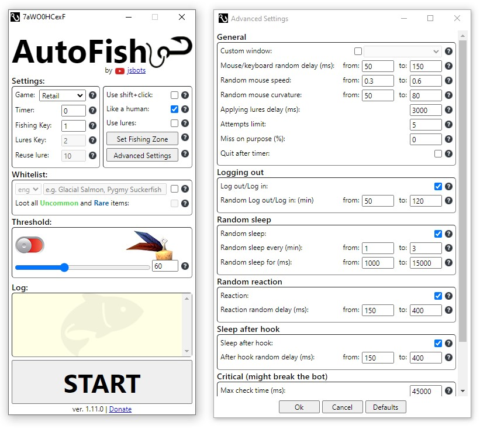
</p>

For video review you can watch this (pretty old)  [AutoFish 1.12](https://youtu.be/A3W8UuVIZTo)

**Important!** The bot works only on **Windows 10/11**.

## Disclaimer :warning:

**This small project was developed for educational purposes ONLY, aiming to explore the feasibility of creating a functional gaming bot using web-development technologies.**

**The software provided should NEVER be used with real-life applications, games, servers etc.**

**This software is not designed to be "undetectable" in any way, nor was it ever intended for such purposes. All randomness functionality is added for educational purposes only.**

**No guarantees or assurances can be made regarding the functionality or outcomes of the bot, you assume full responsibility for any outcomes that may arise from using this software.**.

## Guide :blue_book:

1. Launch the game and the bot.
2. Choose the game you want the bot to work with.

<p align="center">
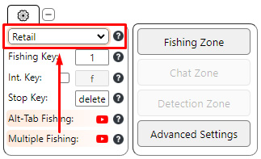
</p>

3. Set up your **Fishing Zone** by clicking the **Set Fishing Zone** button. Adjust the size and position of the **Fishing Zone** window to exclude any reddish or bluish elements (depending on the color you selected). Keep in mind that **Fishing Zone** is an overlay window, so it will also recognize colors from your character and the game's user interface, including texts and health bars.

<p align="center">
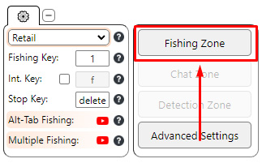
</p>

4. Set up your **Fishing Key** by clicking on Fishing Key section and then pressing the key you want to bind. Your Fishing Key is the same key you bind your fishing skill to in the game.

<p align="center">
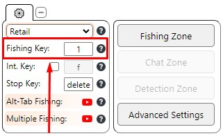
</p>

5. You can press **Advanced Settings** and find there a lot of useful features and options.

<p align="center">
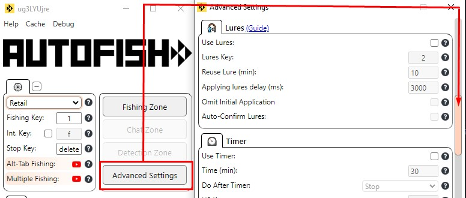
</p>

6. Press the Start button and don't use your mouse and keyboard.
7. To stop the bot, press your designated stop key (default: delete).

### Hints and Issues

- Avoid aggro mobs (with red names) in the Fishing Zone, if you use red color. Or turn them off in the settings (Interface -> Names -> NPC Names -> None)
- If the bot can't find the bobber, try from the 1st person view.
- If the bot doesn't react to animation, try from the 3rd person view.
- The bot works only with default UI: no UI scaling, no UI addons and so on. (Especially ElvUI)
- If the bot doesn't cast, though key is correct, launch it as admin.
- The bot works only on a primary monitor.
- Different camera directions can affect the brightness, size, and visibility of the bobber.
- You can Adjust gamma, brightness, and contrast settings to enhance the brightness of the bobber.
- The bot will auto-confirm lures application if such confirmation is needed.  
- The bot can auto-confirm *Soulbound* items. For that go to Advanced Settings and turn this option on.
- If you use an addon that removes loot window (like Fishing Buddy), you can set *Loot Window Closing Delay* value to 0 to make it work faster.
- The bot works at 50% efficiency on Turtle WoW and won't work better unless you use sound detection available in Premium.
- Any features that print text will use English keyboard layout, so make sure you switched to English before using them.

### Intensity

*If in manual mode*

Intensity value serves as a color threshold below which the bot will ignore all the corresponding colors.

Increasing the intensity value will make the bot recognize fewer red colors, while decreasing this value will cause the bot to recognize more red colors on the screen.

Simply put: decrease this value, if the bot can't find the bobber (e.g. at night, bad weather). Increase this value if you want the bot to ignore some reddish/bluish elements in the Fishing Zone and recognize only the bobber.`

### Sensitivity

*If in manual mode*

If the bot clicks too early, decrease this value. If the bot clicks too late or doesn't click at all, increase this value.

### Interactive key

You can fish with interactive key in the game. If you want the bot to use it instead of mouse movement, turn on Int. Key option and assign the same key you use for interactive key in the game.

<p align="center">
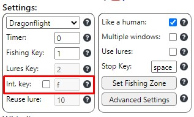
</p>

To make the interactive key work, you should use this commands (write them in the chat and press enter, one by one):
```
/console SoftTargetInteractArc 2  - This will allow you to interact with the bobber no matter which way you are facing.
/console SoftTargetInteractRange 30  - This increases the interaction range to 30 yards. Adjust to your needs
```

## Applying Lures :pushpin:

Go to **Advanced Settings** and check **Use Lures**. Bind your key to the same key you bind your lures or **macro**.

<p align="center">
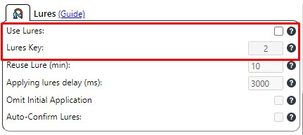
</p>

For **Retail** and **Classic/Vanilla** you need to use a special macro that will apply the lures onto your fishing pole. The names of the lures and fishing pole here only an example, you need to substitute them for your names:

**Retail**:

```
/use Aquadynamic Fish Attractor
/use Big Iron Fishing Pole
```

**Classic**:

```
/equip Big Iron Fishing Pole
/use Aquadynamic Fish Attractor
/use 16
/click StaticPopup1Button1
```

**Vanilla**:

```
/script UseAction(your lures key);
/script PickupInventoryItem(16);
/script ReplaceEnchant();
```
Or
```
/script UseContainerItem(0,2); PickupInventoryItem(16);
```

## AutoFish Premium :gem:

AutoFish Premium is an updated version of the bot with many additional features.

<p align="center">
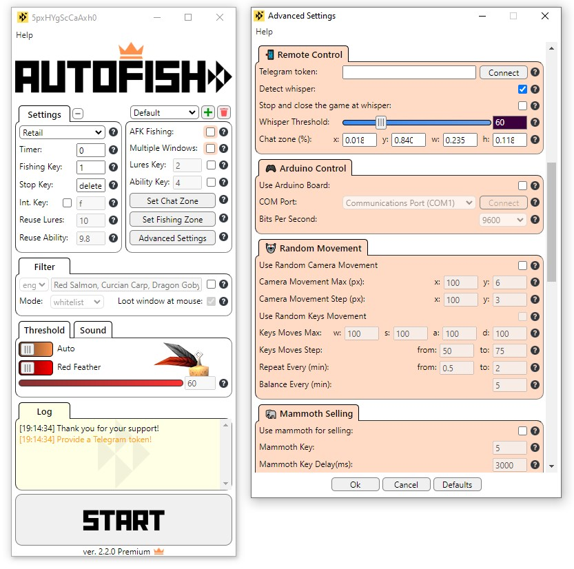
</p>

**Premium Features/Content:**
- [Remote Control / Chat Detection](#remote-control--chat-detection-iphone)
- [AI](#ai-speech_balloon)
- [Multiple Fishing Mode](#multiple-fishing-mode-rocket)
- [Alt-Tab Fishing Mode](#alt-tab-fishing-mode-sleeping)
- [Sound Detection](#sound-detection-loud_sound)
- [Additional Actions](#additional-actions-mage)
- [Random camera/character movements](#random-cameracharacter-movements-robot)
- [Hardware Control](#hardware-control-joystick)
- [Streaming Mode](#streaming-mode-tv)
- [Mount Selling](#mount-selling-elephant)
- [Motion Detection](#motion-detection-runner)
- [Check For Players Around](#check-for-players-around-telescope-unstable)
- [Attacking / Running away](#attackingrunning-away-crossed_swords-unstable)
- Profiles

## Remote Control / Chat Detection :iphone:

You can control the bot via Telegram and it also can detect messages in your chat in the game and notify you.

### Guide:

1. Get the token from [BotFather](https://t.me/BotFather) by using /newbot command and following the instruction. Imagine some long and random name for the bot so that someone won't accidentally join your bot and gain control over your fishing process.
2. Paste the token to **Telegram token** input field in **Remote Control** section in the **Advanced Settings** and press enter.

<p align="center">
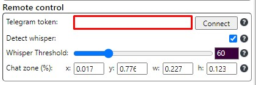
</p>

3. Press **Connect** button and wait until the name of the button changes to either **done** or **error* (*might take awhile*).
4. Open the bot in your Telegram and either press /start or write /start command.
5. If everything is OK, the bot will reply with:

<p align="center">
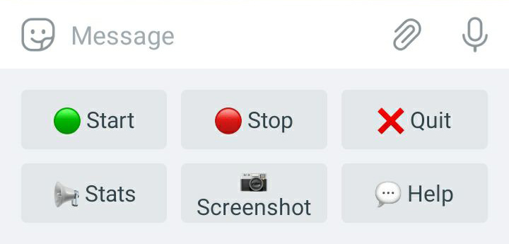
</p>

6. Create a separate tab in your chat and set its background to solid black for better visual detection, especially if you set the bot detect messages **by text**.
7. Now set your **Chat Zone** as on the screenshot below by pressing **Set Chat Zone** button on the main window of the AutoFish.
8. Start the bot from Telegram.

Watch  [Telegram remote control Test Video](https://youtu.be/aKulvFK6ubg)

## AI :speech_balloon:

<p align="center">
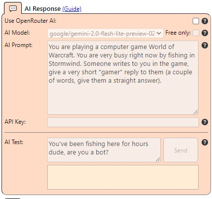
</p>

The bot can use one of **OpenRouter** AI models to generate a response to the messages it detects in the **Chat Zone** (it uses settings from **Remote Control** section).

### Guide:

1. Sign In to [OpenRouter](https://openrouter.ai/) and get an API key: *Profile -> Keys -> Create Key*.
2. Paste it into **API Key** field.
3. Choose a model from the list.
4. You can change **AI Prompt* field to your own context and test the result in **AI Test** section.

## Multiple Fishing Mode :rocket:

In **Multiple Fishing** mode you can use the bot simultaneously with multiple game windows, the bot will switch between the windows and can work with up to 10 windows at the same time.


**Guide(normal mode):**
Ensure each window is properly launched and configured, and **every game instance is set to DirectX 11 or lower** *(older games doesn't need it)*.

In this mode, the bot will use special profiles specific to each window: WIN1, WIN2, WIN3 and so on *(check in profiles list)*. Each "WIN" profile must have a **"Custom Window"** configured *(found under Advanced Settings -> Window)*. Use the **"Focus"** button to check which window you've selected.

**Simple guide:** choose WIN1 in profiles above -> Go to Advanced Settings -> Custom Window -> Choose the window for the first game -> Repeat the same for every next window.


Watch  [Multiple Windows Test Video](https://youtu.be/ih-xoQcByz8)

**Guide(streaming mode):**
Similar logic as with normal mode, but instead each *WIN1, WIN2, WIN3* and so on will use */live1, /live2, /live3* addresses respectively you need to stream to from your OBS (and because you can't stream to multiple sources in OBS you need to have multiple applications running).

Check [Streaming Mode](#streaming-mode-tv) how to stream to the bot from OBS and use it for every window, but instead of */live* rtps address use */live1*, */live2* and so on, as described above. Also check important notes.

Because there's no way for the bot to control the windows on the gaming PC, after starting the bot you need to focus them in right order to make the bot use simple *alt+tab* logic to switch between them.

For example you have 2 windows: after you pressed "Start" you focus *first window* (/live1(WIN1)) then *second window* (/live2(WIN2)) and then back to first window. This way the bot will be able to switch between them in a *blind* way.

Another example if you have 3 windows: after you pressed "Start" you focus *first window* (/live1(WIN1)) then *second window* (/live2(WIN2)) then *third window* (/live3(WIN3)) then back to *second window* and then back to *first window*. Again, this way the bot will be able to switch between them in a *blind* way.

You can use [Sound Detection](#sound-detection-loud_sound) with Multiple Fishing mode while streaming, but don't forget to add audio source (check Sound Detection section).

- **Important!** If in **Streaming Mode + Multiple Fishing** you get video encoder overloading try to lower the bitrate (somewhere 2500-4000) and fps (30 works well as well) for each stream.
- **Important!** [Sound Detection](#sound-detection-loud_sound) won't work in Multiple Fishing **normal** mode, but you can use **Streaming Mode** and just stream to your own computer. 
- **Important!** For every WIN you need to turn on Streaming Mode checkbox (in Advanced Settings) separately, otherwise the bot will ignore it.
- **Important!** You can start the bot from any WIN window, it doesn't matter, the bot will use settings of every WIN respectively. But if you start from some other profile don't forget to check **Multiple Fishing** checkbox.
- **Important** You can try to increase mouse speed for multiple windows in case the bot can't catch up.


## Alt-Tab Fishing Mode :sleeping:

Alt-Tab Fishing Mode will simulate so-called "afk fishing": the bot will focus the window only when your character needs to cast, catch or perform any action and then it will lose focus and return you to the previous window by pressing alt-tab.

**Important!** Doesn't work in [Streaming Mode](#streaming-mode-tv).

Watch  [Alt-Tab Fishing Test Video](https://youtu.be/lQi6fSxMyL0)

## Sound Detection :loud_sound:

<p align="center">
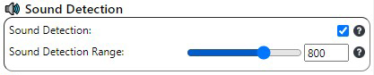
</p>

Sound Detection is an alternative to pixel recognition logic. The bot will hook the bobber only after "splash" sound and won't rely on checking the animation of the bobber plunging.

Before using sound detection turn off Music and Ambient Sounds in the game, leave only Sound Effects. Try to find a place secluded from the sounds made by other players to avoid false detections.

You can also use Alt-Tab Fishing Mode with Sound Detection, with Int.Key + Sound Detection the bot will focus the window only when it needs to cast and when it detects splash sound (turn on **Sound in Background** for that).

Use **"Listen"** button to determine the amplitude of the splashing sound when your bobber plunges in the water: start fishing then press "Listen" button and check for "Max" value when the fish is caught. Do it couple of times to determine the stable value.

If you want to make the bot listen only to the sounds of the game you can use [Virtual Audio Cable](https://vb-audio.com/Cable/) to "pipe" the sound from the game to an input device and then choose it in the settings of the bot. If your game doesn't support in-game choice for sound output device, you can manually set Output device for your game in **"App volume and device preferences"** settings of your Windows to **CABLE input (VB-Audio Virtual Cable)** and then choose **CABLE output (VB-Audio Virtual Cable)** in the settings of the bot.

For Sound Detection to work in [Streaming Mode](#streaming-mode-tv), you need to stream sound as well. So add **Application Audio Capture (BETA)** source in addition to the video source in your OBS.

Watch  [Sound Detection Test Video](https://youtu.be/ZggOy8tA32A)

## Motion Detection :runner:

<p align="center">
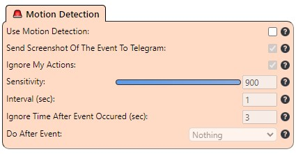
</p>

You can set a zone for motion detection and the bot will notifiy you via Telegram of any events happening in this zone/area. It will also send a screenshot of the motion occured. This feature might help against griefing.  

## Additional Actions :mage:

<p align="center">
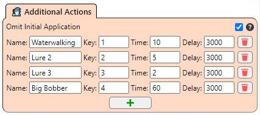
</p>

With Additional Actions module you can perform basically any automation you need during the fishing process. You can automate any mouse or keyboard movements as well as add some additional pixel conditions. It can be used for different things: applying additional lures, opening or deleting some items, automating sending caught fish in the process and so on.

## Mount Selling :elephant:

<p align="center">
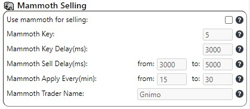
</p>

As an alternative to filtering you can use a trader on your mammoth mount to sell all the junk items during the fishing. The bot will summon your mount, target your trader, interact with it by using interaction key in the game, unsummon the mount and go on fishing.

Because of the novelty of the interaction key this feature is available only for Retail.

Depends on the mount the name of your trader might be different, so change the default value.

Watch  [Mammoth Selling Test Video](https://youtu.be/zY2LqAPszdg)

## Random Camera/Character Movements :robot:

<p align="center">
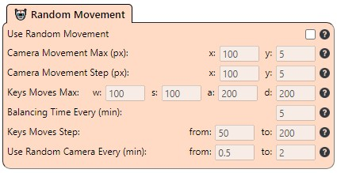
</p>

The bot will randomly move and change your camera direction from time to time within the provided radius.

Watch  [Random Camera/Character Movements Test Video](https://youtu.be/o1hU3fNn4uk)

## Hardware Control :joystick:

<p align="center">
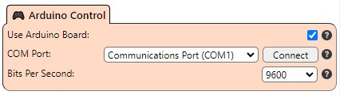
</p>

The bot is able to connect to your Arduino Board/Raspberry Pico W and use it to emulate a mouse/keyboard device, it will look like a real keyboard or mouse to the OS and the game. What you need to do to make it possible:

1. Get an Arduino with an ATmega32U4 on board (any cheap copies for 2-3$ will do too, you can find them on Chinese online markets).
2. Connect it to your computer.
3. Install [Arduino IDE](https://www.arduino.cc/en/software).
4. Click **New Sketch** and replace everything there with this sketch: [Arduino Sketch](https://github.com/jsbots/Clicker/blob/main/clicker_sketch/clicker_sketch.ino).
5. Click **Tools** -> **Port** and choose the port your Arduino Board connected to.
6. Click **Sketch** -> **Upload** and wait until the code uploads to your board.
7. Launch AutoFish, click **Advanced Settings** turn on **Use Arduino Board** option and choose the port your Arduino Board connected to, press **Connect** button.

For **Raspberry Pico W** guide check [Streaming Mode](#streaming-mode-tv).

Watch  [Hardware Control Test Video](https://youtu.be/yE-qARS73oo)

## Streaming Mode :tv:

<p align="center">
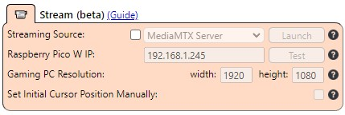
</p>

Streaming Mode is used to run the bot and the game on different computers, you can use either hardware device for capturing your screen or stream it with OBS to the MediaMTX Server provided by the bot *(recommended)*.

In both cases you need a **Raspberry Pico W** device to simulate hardware input, how to configure and connect it you can find in this video:  [AutoFish 3.1 - Streaming Mode](https://youtu.be/Kacworq8j8Q) *The files for Pico W will come with the bot archive*

- **Important!** In Streaming Mode after you press start the bot waits 5 seconds before starting *(by default)*. If you use VM on your host computer this time is given for you to focus the game manually, the bot won't do it on its own, because well... it's not on your host computer so it can't control your windows.

### Hardware

How to use hardware device:  [AutoFish 3.1 - Streaming Mode](https://youtu.be/Kacworq8j8Q)

- **Important** Turn off [Enhance Pointer Precision](https://www.wikihow.com/Enhance-Pointer-Precision#:~:text=Enhance%20Pointer%20Precision%20changes%20your,gaming%2C%20consider%20disabling%20this%20feature.) in your Windows.
- **Important!** If you run into any issues with Pico W (Like why it can't connect to your wifi and so on), you can install [Mu Editor](https://codewith.mu/) and check the errors in **Serial** section.

### Streaming Server

1. Choose **Streaming Server** as streaming source and then press **Launch** button. The bot will start RTSP server and will show (in the log) your RTSP address.
2. Install [OBS](https://obsproject.com/) on your gaming pc (where the game will run).
3. In OBS navigate to Settings -> Output -> Output Mode: Advanced -> Recording. Then configure it like this:

- **Type**: **Custom Output(FFmpeg)**
- **FFmpeg Output Type:** Output to URL
- **File Path or URL**: Put here the address given by the bot, *e.g. rtsp://192.168.1.2:8554/live*
- **Container Format**: rtsp
- **Video Bitrate**: 6000 Kbps (experiment with this to get a better quality)
- Check **show all codecs (even if potentically incompatible)**
- If you have **AMD** GPU choose **h264_amf - AMD AMF H.265 Encoder** or If you have **NVIDIA** GPU choose **h264_nvenc**
- **Video encoder settings (if any)**: bf=0
- **Audio Track**: 1
- **Audio Encoder**: libopus - libopus Opus *(don't confuse it with Opus)*

4. **Add Scene**. Then **Add Source** -> **Game Capture**. Then right-click on it and choose **Properties**. Turn off **Capture Cursor**. If you use [Sound Detection](#sound-detection-loud_sound) add **Application Audio Capture (BETA)** source in addition to the video source in your OBS.
5. If you have some additional networks (VPN and so on) make sure your OBS is connected to the same one the machine with the bot is connected to. (Advanced -> Network)
6. Press **"Start Recording"** *(Yes, Start Recording, not Start Streaming)*. If the log has a green line "Stream is being published to /live" then you successfully started streaming to the server.
7. Now press **Set Fishing Zone** and check if you can see your stream.
8. Press **Start Button** and wait until the bot start counting *(you can change counting time in Advanced Settings)*, during this time you need to focus your game on the PC where the game is running (or focus windows in a proper order if you run it in [Multiple Fishing Mode](#multiple-fishing-mode-rocket))

- **Important** Turn off [Enhance Pointer Precision](https://www.wikihow.com/Enhance-Pointer-Precision#:~:text=Enhance%20Pointer%20Precision%20changes%20your,gaming%2C%20consider%20disabling%20this%20feature.) in your Windows.
- **Important!** Streaming Mode will work only for games in Fullscreen, that's why Game PC Resolution is the setting both for your gaming PC and the game.
- **Important!** If you use any of the *color pickers* in Streaming Mode make the tolerance value lower, because the image you stream from OBS could be very dynamic.  
- **Important!** Make sure your firewall doesn't block 8554 port.

### VM

Instead of another PC you can use a Virtual Machine for either Hardware or Streaming Server approach. There are a lot of guides how to install and use VM, so I won't cover it here (tested it on VMware).

- **Important!** Use Windows 10 on your VM for the most stable results.
- **Important!** Make sure your VM uses **Bridge** type of **Network Connection**.
- **Important!** When setting Fishing Zone while using Streaming Server the stream image might be green, just minimize your VM window then focus it again.
- **Important!** If you want to use it with Hardware capture device, make sure to connect it to the VM instead of host PC *(you connect it to your GPU and then to your USB and after it detects a new hardware you choose it work for VM only)*.


## Check For Players Around :telescope: (unstable)

With some additional configuration you can set the bot to check for other players around. If it finds any it will notify you via telegram and sends a screenshot of the player found. It will search for players in front of you every second and players around you every minute (default).

*For now it works only with players within 40 yd. range, because it relies on a target key.*

Before using it you need to make some simple preliminary configuration:

1. Click on color picker icon from "Target HP" option and set it somewhere on the green field of your target health bar. You can target yourself before setting if there's no other player/NPC around.
  *vanilla* - If you play on Vanilla server you might need to set "Target HP Exception" value, because on Vanilla servers "Target Nearest Friend" also targets your own character, it should be a unique to your character target window pixel (some pixel on your name or your avatar).
2. Bind your "Target Key" to the same targeting key you use in the game (if you wish to target other players, it should be something like "Target Nearest Friendly Player").  
3. Choose what the bot should do after it finds a player in "Do After Player Found" option.

### Hints and issues
- Tweak rotation time if the 360 degree turn isn't correct.
- You can turn on "Target of target", in that case you will see on the screenshot recieved whether the found player is targeting you specifically.
- This functionality won't work for non-hostile enemy players on Retail, because target friendly/enemy key doesn't target them in the game nor they have any names above if they aren't targeted first.   

## Attacking/Running away :crossed_swords: (unstable)

This module isn't "plug&play" and requires proper initial configuration and testing before using.

*It definitely won't defeat anyone except for mobs, so choose a simple class for that role and make your rotation as simple as possible (some range class with simple spells that works both in melee and in range would do perfectly).*

*For now it works only with players within 40 yd. range, because it relies on a target key.*

The bot will notify you via telegram of any aggro events.

Guide:
1. Turn off the nameplates (ctrl + v) and turn on Enemy Names (Options -> Interface -> Enemy Players), you can also set NPC names to "None" to make the bot avoid mobs names.
2. Click on color picker icon from Combat Indication Pixel and point it at the place which changes when your character switches to combat mode. Usually it should be a place which changes when the character is in combat mode: for example the place where character level is, which usually changes to "double swords" or the rim around the avatar which changes to red when in the combat mode.
3. Choose what to do after the bot is being attacked: Attack, Run Away or Stop. (Run Away is the most stable choice for now).
4. Click on color picker icon from Enemy HP Pixel and point it somewhere on the green field of your target health bar.
5. Bind your "Target Key" to the same targeting key you use in the game (if you wish to target other enemy players, it should be something like "Target Nearest Enemy Player", or "Target Nearest Enemy" if you want to target mobs too).  
6. Click "+" button, if you chose "Attack" mode:
  1. If your skill works only at range but doesn't work in melee, turn "Range Only" on. (But better choose another, more universal and simpler skill)
  2. Bind the same key the skill is bound to in the game.
  3. Click on color picker icon from Skill Position and point it exactly at the number of the skill (the color should be whitish/greyish), this number is usually used for range indication and the bot will check it to determine how far it is from the enemy and how much it should come up to it.
  4. Execution time and cooldown you can find in the description of the skill and set them in the respective values.

Use "Test Rotation" button to see what will happen if you are attacked during fishing and check whether your rotation and the bot works properly for you.

### Hints and issues:
- You can change the size of enemy names in Accessibility section -> "Minimum Character Name Size". You can make it bigger to make the bot recognize enemies easier.  


## Download :open_file_folder:

<p align="center">
<a href="https://www.buymeacoffee.com/jsbots"></a>
</p>

Check again [Disclaimer](#disclaimer-warning) before downloading or running any of these (*I'm serious, the bot has been there for 3 years and people are still doing stupid things with it. Don't launch/use it if you are new to this stuff.*):

AutoFish 2.8.3: [Download](https://github.com/jsbots/AutoFish/releases/tag/v2.8.3)

AutoFish 3.3.0 Premium (trial version): [Download](https://buymeacoffee.com/jsbots/e/258390)

AutoFish 3.3.0 Premium: [Download](https://www.buymeacoffee.com/jsbots/e/96734)
