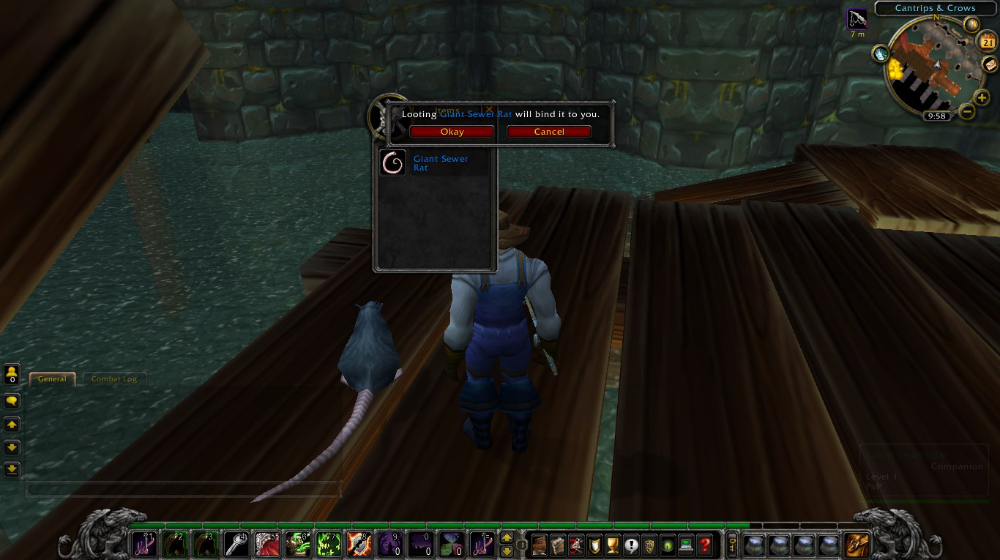
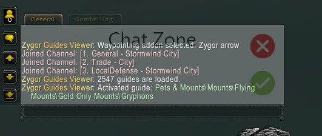

<p align="center">  </p>
<div align="center">

  [](https://github.com/olesgeras/AutoFish/blob/4c5f0fdb5af0f1378f3318d563c5738fa7580e2f/LICENSE)
<a href="https://youtu.be/A3W8UuVIZTo"></a>

</div>

## Table of Contents :page_with_curl:

- [Fishing bot](#fishing-bot-fish)
- [Servers tests](#servers-tests-video_game)
- [Warninig](#warning-warning)
- [Guide](#guide-blue_book)
- [Known Issues](#known-issues-red_circle)
- [Soulbound items](#soulbound-items-auto-confirmation-large_blue_diamond)
- [Telegram remote control](#telegram-remote-control-iphone)
- [Additional Info](#additional-info-pushpin)
- [Fishing zone](#fishing-zone-dart)
- [Download](#download-open_file_folder)
- [Installation](#installation-hammer)


## Fishing bot :fish:

A fishing bot for World of Warcraft, wrapped in [Electron](https://github.com/electron/electron) it uses [keysender](https://github.com/Krombik/keysender) library to analyze the screen and automate a fishing process in a human-like manner. The bot can work with one or multiple windows of the game at the same time. The bot also uses [tesseract.js](https://github.com/naptha/tesseract.js) for analyzing loot.

<p align="center">

</p>

**Features:**
- Multiple windows support.
- Optional loot support.
- Fishing lures support.
- Custom window suppport.
- Auto confirmation for soulbound items.
- Missing on purpose feature.
- Logging out/in feature.
- Switching between red/blue feathers feature.
- Convoluted automation (random sleep, random reaction, random sleep after catching, random mouse speed/curvature, random click on the bobber, random bobber highlighting)

For more detailed review you can watch  [AutoFish 1.12](https://youtu.be/A3W8UuVIZTo)

This is so called "pixel bot", it doesn't change anything in the processes memory nor use any vision libraries like OpenCV, it uses a simpler solution: it analyzes the window of the game for condensed red colors and then sticks to them checking the area for changes. It moves with the bobber while the bobber slowly wobbles, but when the bobber is jerked, it clicks on it and catches the fish.

The bot doesn't work in the background and requires the window of the game to be opened all the time, to get around this you can use a **virtual machine** (like [VirtualBox](https://www.virtualbox.org/) or [VMware Player](https://www.vmware.com/products/workstation-player.html)) with installed World of Warcraft and launch AutoFish there. *(tested)*

## Servers tests :video_game:

The bot was tested on official servers:
-   **Retail**
-   **Classic**
-   **WotLK Classic**

Also on unofficial servers:
-   **Shadowlands**: firestorm-servers.com
-   **MoP**: stormforge.gg
-   **Cataclysm**: apollo-wow.com
-   **WotLK**: warmane.com
-   **TBC**: atlantiss.org
-   **Vanilla**: kronos-wow.com

On custom servers:
-   **Turtle WoW**: turtle-wow.org (use blue switch for better performance)
-   **Ascension**: ascension.gg - doesn't work!

## Warning :warning:

If you are going to use the bot on unofficial servers, skip this section. It's very unlikely you need any of this.

Using bots in most of the games is prohibited, by doing so you should understand all the risks such an act entails: being banned, losing account, losing real money etc.

The bot is written in JavaScript, when writing the bot I didn't have acess to low-level operations like utilizing mouse, keyboard and screen. It's done by [keysender](https://github.com/Krombik/keysender), so I can't guarantee anything that comes from this particular low-level domain.

To prevent detection all the delay values were randomized: delays between clicks/pressing, sleep time (optional), reaction time (optional), after hook time (optional), the curvature and the speed of the mouse (optional), random click on the bobber, random highlighting of the bobber, the names of the folder where the bot is installed are generated per install, the names of the title of the bot window are generated per launch.

Using common sense while using the bot will help to reduce risks of being banned:
- Don't leave the bot alone for a long time.
- Don't fish in one place all the time.
- Try to combine gameplay between fishing: run some dungeons, chat with somebody etc.

Anyone who can see you for more than 15m on one spot might suspect something and report you, or might not.  It all depends on many external factors: who, where and why. In my opinion, the biggest problem with people being banned is because they don't know how to cheat, not because of the software. So again, if you decided to step on this path: think and use common sense, no software will do this for you.

:bangbang: Read [this](https://www.ownedcore.com/forums/wow-classic/wow-classic-guides/933772-what-you-need-know-if-you-want-use-fishing-bot.html#post4281886) and use **Miss on purpose** and **Log in/Log out** options as described in that guide. You can change **Sleep after hook** and **Random sleep** options to wider random range (e.g Randomly sleep from 1 - 10 min) to make number of casts per session even more randomized. All this will decrease the efficiency but might save your account. It's up to you what's more important.   


## Guide :blue_book:

The bot was tested only with default UI and with default UI scale, without any addons whatsoever. **So turn off all the addons and set UI scale to default before using the bot.**

1. Launch the game *(not as administrator)*.
2.  :exclamation: :exclamation: :exclamation: Switch to the **DirectX 11** on Retail/Classic *(skip for unofficial servers)*.
4. Switch to **Window** or **Window(maximized)** mode *(skip for Retail/Classic, fullscreen there already works as maximized)*.
5. Are you using whitelist?
   - Yes: Turn off **Auto Loot**, set **UI scale** to default, turn on **Open loot window at mouse**.
   - No: Turn on **Auto Loot**
7. Assign your 'fishing' and 'lures' keys in the game and write them in the respective sections in the UI of the bot.
8. Equip a fishpole.
9. Find a good place to fish (check [Fishing zone](#fishing-zone-dart) section).
   - Avoid any red/blue colors in the "Fishing zone" except the red/blue feather of the bobber.
   - Initially the bot will make a preliminary check for red/blue colors before casting, if it finds any, it will stop working: change your **Fizhing Zone** or increase Threshold or change the place.
   - The bot will make 5 attempts to cast and find the bobber (you can change this number in the "Advanced Settings"). If it fails, it will stop the application.
10. The bot doesn't work in the background, so don't use your keyboard and mouse while the bot is working.
11. You can press **'space'** to **stop the bot**.

## Known issues :red_circle:

- If the bot can't find the bobber, decrease "Threshold" value (and be sure you are on DirectX 11).
- If the bot still can't find the bobber, it might be because the bobber appears too slowly and the bot should wait longer before looking for it: increase **Cast animation delay** option in the **Advanced Settings**.
- If the bot can't pass the preliminary checks for red colors, tweak your **Fishing Zone** by pressing **Set Fishing Zone** button or increase "Threshold" value.

## Fishing Zone :dart:

Fishing zone is a resizable and movable area in the water where your bobber might land. The bot looks for the bobber only in this area.

You can change the dimensions of this zone by clicking on **"Set Fishing Zone"** button. The application will open the window with your game and you can resize and move it as you like.

<p align="center">

</p>

The rule of thumb here is **the better you can see the red/blue feather the better the bot will see it too**:
- If you can, make your video settings as best as possible, except the weather effects...
- Turn off all the weather effects so that the bot won't confuse rain/fog for jerking of the bobber. But if the weather is *really* bad (like a blizzard), it might drastically reduce the efficiency of the bot *(working on make it better)*. Solution: find another place, switch between blue/red feathers or wait for the better weather.
- Different direction might make the red feather of the bobber either brighter or darker, bigger or smaller, this all will impact the efficiency of the bot. In most cases the place doesn't matter **it's all about direction and position**.
- Camera position isn't so important, but sometimes, if the place is dark/snowy, closer view to the bobber might help. The best position is just a normal 3rd person view.
- Tweak gamma/brightness/contrast settings to make the bobber brighter and more colorful.
- For very dark zones you can try other bobbers that have distinct red/blue colors on them instead of the default one. 

Watch  [AutoFish 1.12](https://youtu.be/A3W8UuVIZTo) for video explanation.

Here are quick self-explanatory "good-bad" screenshots of the bobber:
<p align="center">


</p>

## Soulbound items auto-confirmation :large_blue_diamond:

If you want the bot to confirm rare Soulbound items, turn on **Loot all Uncommon and Rare items** option. If the item requires confirmation on looting, the bot will confirm it automatically. **This won't work with AutoLoot turned on**, so if you need such items always use **whitelist**. **This feature also doesn't work with any other language except English**. As a solution (both if you need AutoLoot on and if your WoW isn't in English) use [AutoLooter](https://www.curseforge.com/wow/addons/autolooter) instead. 

<p align="center">

</p>

## Telegram remote control :iphone:

1. Get the token from [BotFather](https://t.me/BotFather) by using /newbot command and following the instruction. Imagine some long and random name for the bot so that someone won't accidentally join your bot and gain control over your fishing process. 
2. Paste the token to **Telegram token** input field in **Remote Control** section in the **Advanced Settings** and press enter.

<p align="center">

</p>

3. Press **Connect** button and wait until the name of the button changes to either **done** or **error*. 
4. Open the bot in your Telegram and either press /start or write /start command.
5. If evertyhing is OK, the bot will reply with:
```
AutoFish was connected to the bot successfully!
/start - starts telegram bot
/startbot - starts AutoFish
/stopbot - stops AutoFish
/statsbot - shows stats
/quitgame - quits from all the windows opened
/w *username* - whispers to *username*
/help - list of commands
```
6. Now set your **Chat Zone** as on the screenshot below by pressing **Set Chat Zone** button on the main window of the AutoFish. 

<p align="center">

</p>


7. Whisper detection will work **much better and reliable** if you turn off all the other chat messages. 


## Additional info :pushpin:

- If you play on **Classic/Vanilla** and want to use lures, use a macro that will apply the lures automatically onto your fishpole and assign that macro to Lures Key section:

**Classic**:
```
/equip *your fishing pole name*
/use *your lures name*
/use 16
```

**Vanilla**:

```
/script UseAction(*your lures key*);
/script PickupInventoryItem(16);
/script ReplaceEnchant();
```
- You can turn off all the "sleeping" and random values to make the bot work 2-3 times faster.
- If you use whitelist feature in different from English languages for the first time, wait until the bot downloads the data for your language.
- Don't fish near other players, the bot might confuse their bobber for yours.
- Whitelist works properly only with standard 16:9 resolutions (if you use ultrawide monitor, switch to 16:9 windowed mode)
- If the bot often misses the "jerking" of the bobber and does nothing, as a solution you might need to make your camera more horizontal, so that the bot "sees" the "jerking" animation better:
<p align="center">

</p>

## Download :open_file_folder:

<div align="center">

<a href="https://www.buymeacoffee.com/jsbots" target="_blank"></a>

 </div>

AutoFish 1.12.0 Setup: [Download](https://www.buymeacoffee.com/jsbots/e/95380) 

It's open-source software, so if you are afraid of downloading the executable file,  you can clone the repository, check the code and lanch it from the CLI.

The executable file is a [squirrel](https://js.electronforge.io/maker/squirrel/interfaces/makersquirrelconfig#authors) setup, it will install the bot into a folder under a random name and create a shortcut with a random name on your desktop.

You can uninstall it in the Windows Settings, the name of the uninstall will be the same name as the name of the shortcut.

If you downloaded a new setup, you need to uninstall the previous AutoFish first, because the random names of the application and the folder are generated per install, so it won't automatically re-install a new application in the folder of the previous.

